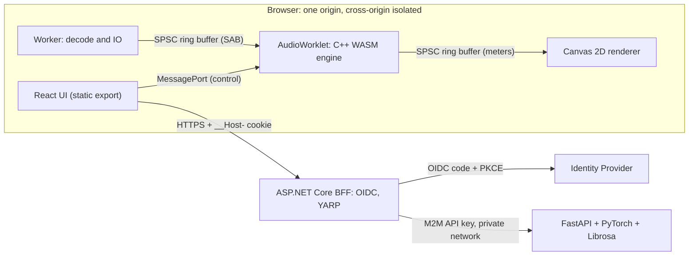

# 🎵 Music & Audio Engineering Handbook (2026–2028)

My 24-month plan (Sep 2026 → Sep 2028) to build and defend a **Web Audio + AI/ML capstone**, understand the real-time engineering beneath web audio platforms, and become hireable at **Spotify** (first choice) and **digital audio software companies**. This repo holds my findings, lab sub-projects, and the capstone code.

> **Now:** Month 0 (Sep 2026), before Level 3 Semester 1
> **Progress:** `[█░░░░░░░░░░░░░░░░░░░]` 3 / 116 milestones (3%)
> **Next gate:** G1 Walking Skeleton (Month 8)

---

## 🔑 1. How to Use This File

| Tag | Meaning | Tick it when… |
|---|---|---|
| 🎓 **University** | Taught in a course. I do **not** self-study the theory. | The course has covered it and I can restate it without notes. |
| 📖 **Self-study** | Not in my curriculum. I learn it myself. | Its exit criterion is met and the result is committed. |
| 🔀 **Hybrid** | Theory from a course, application built by me. | The applied result is committed to the repo. |
| 🚦 **Gate** | Go/no-go checkpoint. | Every criterion holds. |

**Weekly ritual (Sunday, 20 min):** update checkboxes and the progress line, write `docs/log/YYYY-Www.md` (hours spent, done, blocked, one thing measured). At each phase exit, tag the repo `phase-NN-done`.

**If I fall behind:** apply the cut order in Section 10. Never silently extend a phase.

> ⚠️ 🎓 tags are **inferred from module titles**. I haven't seen the syllabi. In Weeks 1–2 of each semester, compare the outline with the 🎓 items and downgrade to 📖 whatever the course doesn't actually teach.

---

## 🎯 2. Success Criteria (Month 24)

1. A deployed, secured, browser-based audio application whose DSP core is **C++ compiled to WASM, running in an AudioWorklet**, with measured latency headroom and zero dropouts in a soak test.
2. An ML tagger that **beats a classical baseline** on a leakage-free split, with error analysis and a model card.
3. A written and defended **evaluation** (engine correctness, real-time behavior, model quality, security audit).
4. A public repo and write-ups that let me explain every layer from the audio callback to the login cookie.

---

## 🧪 3. Assumptions to Verify (Weeks 1–2)

The plan is built on these. If one is wrong, fix the plan, not the reality.

| # | Assumption | Verify with | If wrong |
|---|---|---|---|
| A1 | Semesters run roughly Oct–Mar, Apr–Sep, and each ends with an exam/assignment month | Academic calendar | Shift months; keep one buffer month per semester |
| A2 | **ML and Linear Algebra** run in L3 S2; **Deep Learning and Tensors & Graphs** in L4 S1; **Functional Programming and Application Security** in L4 S2 (the tables list these electives without fixing a semester) | Timetable / registrar | ML earlier is fine. If Deep Learning lands in L4 S2, Phase 8 loses course support and leans on self-study. If Application Security lands in L4 S1, OIDC work in Phase 9 gets theory first (better). |
| A3 | **Industrial Training** (mandatory internship, 6 credits) is heavy and runs alongside Capstone Part 2 | Department | If part-time, spend the extra hours on Should items |
| A4 | Capstone Part 1/2 have proposal, design, prototype, and defense milestones on university dates | Capstone handbook, supervisor | Move gates G2–G4 to match |
| A5 | Technology Challenge Competition has fixed rules/teams | Course outline | Never depend on it. Use it as a capstone prototype only if the topic is free. |
| A6 | NLP, ML, DL, Tensors & Graphs, Application Security teach what their titles imply | Syllabi | Downgrade 🎓 to 📖 and re-plan that item |
| A7 | Self-study capacity: ~10 h/week (L3), ~12 h/week (L4 S1, counting Capstone Part 1 hours), ~6 h/week (L4 S2) | Log actual hours for 4 weeks | Apply the cut order if under 70% of these |
| A8 | Levels 1–2 (not visible to me) may already cover C/C++ or web basics | Old transcripts | Tick those items after a short refresher |
| A9 | Internship placement is arranged by me or by the department | Department | If self-arranged, protect Months 14–17 for applications |

---

## 📜 4. Ground Rules & Conflict Design

**Ground rules**

1. **Engine-First.** Implement core mechanics by hand (FFT, biquad, loudness meter, ring buffer) as a reference before using any abstraction.
2. **Capstone Gate.** Anything that doesn't directly build a capstone component is cut or moved to Post-Defense (Section 12).
3. **Capstone technology boundary (locked).** UI: React client-side rendering via static export, no SSR. Engine and visuals: Web Audio API, AudioWorklet, C++ compiled to WASM, Canvas 2D at 60 fps. Security: ASP.NET Core BFF, `__Host-` cookies, `SameSite=Strict`, no CORS. ML: isolated FastAPI service with PyTorch and Librosa, machine-to-machine API key.
4. **Tier 3 exit.** A phase isn't done until its deliverable is Tier 3: memory preallocated, lock-free inter-thread communication, numerically stable DSP, real tests.
5. **AI-native, with a hard boundary.** Agents accelerate me; every diff is reviewed. Never delegate wholesale: audio-thread code, lock-free queues, inner DSP loops.
6. **Every assignment with a free topic choice becomes a capstone prototype.** If the topic is fixed, I do it normally and don't force it.
7. **One language per layer:** TypeScript (UI/glue), C++ (DSP core), C# (BFF), Python (ML).

**How this plan avoids conflicts with the university schedule**

- **Prerequisite order:** no self-study item needs a course concept before that course's semester (subject to A2).
- **Buffer months (6, 12, 18, 24):** exam/assignment/defense periods carry only light work.
- **One heavy track at a time.** The only overlaps (Months 15–17) are marked and covered by the cut order.
- **Courses are accelerators, not dependencies.** The plan never waits on an assignment topic or a lecturer's schedule.
- **L4 S2 has zero feature work.** All features freeze at Month 17, before the internship semester.

I can't see your timetable, so "non-conflicting" means: no structural conflicts visible from the curriculum tables. The assumptions above are where a conflict would hide.

---

## 🗓️ 5. Timeline at a Glance

| Month | Calendar (assumed) | Semester | Mode | Self-study phase |
|---|---|---|---|---|
| 0 | Sep 2026 | Before L3 S1 | Setup | **P0** Repo & workflow |
| 1 | Oct 2026 | L3 S1 | Active | **P1** Web foundations & secure delivery |
| 2–3 | Nov–Dec 2026 | L3 S1 | Active | **P2** Web Audio API |
| 4–5 | Jan–Feb 2027 | L3 S1 | Active | **P3** Visualization & React–audio integration |
| 6 | Mar 2027 | L3 S1 | **Buffer** | Charter v0, Python primer |
| 7–8 | Apr–May 2027 | L3 S2 | Active | **P4** AudioWorklet, shared memory, first WASM · 🚦 **G1 Walking skeleton** |
| 9–10 | Jun–Jul 2027 | L3 S2 | Active | **P5** DSP fundamentals |
| 11 | Aug 2027 | L3 S2 | Active | **P6** MIR features, dataset, baseline · 🚦 **G2 Charter v1 + baseline** |
| 12 | Sep 2027 | L3 S2 | **Buffer** | Reading only |
| 13–15 | Oct–Dec 2027 | L4 S1 | Active | **P7** C++ real-time DSP engine → WASM |
| 15–17 | Dec 2027–Feb 2028 | L4 S1 | Active | **P8** Deep model & ML service *(overlaps P7 in M15)* |
| 16–17 | Jan–Feb 2028 | L4 S1 | Active | **P9** BFF, OIDC & integration · 🚦 **G3 Feature freeze (M17)** |
| 18 | Mar 2028 | L4 S1 | **Buffer** | Reading, internship logistics |
| 19–21 | Apr–Jun 2028 | L4 S2 | Internship + Capstone 2 | **P10** Evaluation, hardening & audit · 🚦 **G4 Audit closed (M21)** |
| 21–24 | Jun–Sep 2028 | L4 S2 | Internship + Capstone 2 | **P11** Thesis, defense & applications |
| 24 | Sep 2028 | L4 S2 | **Defense** | 🎯 Final release & defense |

**Highest-risk stretch: Months 15–17** (five courses plus three overlapping phases). The cut order exists for this.

---

## 🧭 6. University vs Self-Study Coverage

| Area | 🎓 Covered by university | 📖 Self-study (not in the curriculum tables) |
|---|---|---|
| Architecture, process, quality, design | Software Architecture, SE Methods, SQA, Advanced Software Design | Audio-specific testing: golden files, `OfflineAudioContext`, real-time soak tests |
| Mathematics | Discrete Mathematics, Linear Algebra | Complex numbers/Euler, Fourier series, DFT/FFT, LTI systems, convolution, Z-transform, filter design, numerical stability (Numerical Analysis isn't in my plan) |
| ML / AI | Machine Learning, AI, Deep Learning, Tensors & Graphs, NLP | Audio features (STFT/mel/MFCC), MIR, dataset leakage, PyTorch practice, FastAPI serving, evaluation on audio |
| Security | Application Security | BFF, cookies, COOP/COEP, OIDC implementation, auditing my own system |
| Research and ethics | Research Methods, Human Behavior & Ethics | Perceptual audio evaluation (A/B, MUSHRA-lite), loudness standards |
| Functional programming | Functional Programming | Applying it to pure DSP kernels |
| Web (HTML/CSS/JS/TS/React) | Not in the L3–L4 tables | All of it: media, forms, layout, JS internals, strict TS, React–audio lifecycle |
| Web Audio, AudioWorklet, SharedArrayBuffer, WASM | Nothing | All of it |
| C++ and real-time systems | Nothing in the L3–L4 tables | All of it (refresher only if Levels 1–2 covered it) |

**The hardest self-study block is DSP.** No course in the tables teaches signals, Fourier analysis, or filters. Linear Algebra and Discrete Math help, but they aren't a substitute.

---

## 🏗️ 7. Capstone Reference Concept: **Audio Studio**

> A reference concept. I can replace it at **G2 (Month 11)** if the replacement still has: a measurable real-time constraint, an ML component with a baseline, and a written evaluation plan.

**A browser-native, loudness-aware mastering assistant.** Streaming platforms normalize loudness, so mastering choices (integrated loudness, true-peak headroom, dynamics, spectral balance) affect playback. Audio Studio measures them in real time on the client (C++/WASM), classifies the track with a server-side ML tagger, and recommends target settings. (Platforms use their own targets. Spotify's default is commonly cited as around −14 LUFS. Verify against current documentation before hard-coding.)

**Research questions**
- **RQ1.** Can a C++/WASM engine in an AudioWorklet run a metering + processing chain inside a fixed fraction of the render quantum, and how does it compare with plain JS and native reference results?
- **RQ2.** Does a mel-spectrogram CNN beat an MFCC + classical baseline on an artist-disjoint split, and does temporal modeling add anything?
- **RQ3 (Should).** Do tag-informed suggestions beat generic presets in a blind A/B test?



**Design rules:** ML is never in the audio path. The client never computes model features (the server does, with Librosa), which removes train/serve skew (ADR-004). `dsp-core` has no Emscripten or JUCE dependency, so a native wrapper is possible after the defense.

**Real-time budget:** 128-frame quantum ≈ 2.9 ms at 44.1 kHz. Target: `process()` p99 under **50% of the quantum** on my reference machine (a target I chose; tune after measuring). Zero heap allocations attributable to `process()`.

**Scope tiers**
- **Must:** WASM engine (biquad EQ, BS.1770 loudness meter, limiter), spectrum/waveform on Canvas 2D, ML tagger beating baseline, hardened BFF session (`__Host-`, `SameSite=Strict`, no CORS, M2M key), evaluation report, security audit.
- **Should:** compressor, suggestion engine + A/B test (RQ3), OIDC login, temporal (CRNN/attention) ablation, Chrome/Firefox/Safari matrix.
- **Could:** extra effects, session save/load.

**Evaluation plan**

| Component | Claim | Method | Pass criterion |
|---|---|---|---|
| Loudness meter | Conforms to BS.1770 / EBU R128 | Published compliance test signals | Within the test set's tolerance (typically ±0.1 LU) |
| Filters / EQ | Response matches design | Compare with SciPy `freqz` | Max error target under 0.05 dB, 20 Hz–20 kHz |
| Real-time behavior | No dropouts | 30-min soak; repeat under 4× CPU throttling | 0 underruns at 1×; degradation documented at 4× |
| WASM vs JS | Speedup and boundary cost | Benchmark harness, per-quantum timing | Ratios with variance; no pre-committed number |
| ML tagger | Beats baseline | Artist-disjoint test split; macro-F1 and PR-AUC with bootstrap CIs | Improvement outside CI |
| Suggestions | Preferred over presets | Blind A/B, n ≥ 10, ethics approval | Win rate with CI |
| Security | No serious findings | STRIDE, manual checklist, ZAP scan | Zero unresolved High findings |

---

## 🎯 8. Career Targets

> Hiring requirements change. At Months 12 and 18, pull ~10 current postings per company and diff them against this plan.

| Skill | Where I build it | Evidence |
|---|---|---|
| Web player engineering (React/TS, performance, a11y) | P1, P3 | Perf numbers, a11y audit |
| Loudness and audio processing | P5, P7 | `dsp-core` + compliance report |
| Audio ML / MIR | P6, P8 | Model card, baselines, ablations |
| Services and security | P8–P10 | BFF + ML service, audit report |
| Real-time profiling | P4, P7, P10 | Benchmark reports |
| **Streaming (MSE, adaptive streaming), JUCE/native plugins** | *Outside the capstone boundary → Post-Defense (Section 12)* | — |

**Honest trade-off:** Spotify's core streaming skills (Media Source Extensions, adaptive streaming) aren't in the capstone boundary, so they wait until after the defense. The mandatory internship is the natural place to get backend/streaming exposure. Study their open source meanwhile: **Basic Pitch** (polyphonic pitch detection with a browser-side TypeScript port) and **Pedalboard** (Python audio-effects library backed by JUCE).

---

### Lane D: AI-native workflow (ongoing, no checkbox)
Keep `CLAUDE.md` current. Log AI-written diffs that failed review (hallucinated APIs, hidden allocations, races) in the weekly log.

### Gates

| Gate | Month | Must be true to proceed |
|---|---|---|
| G1 Walking skeleton | 8 | One command starts all services; isolation on; WASM kernel audible; BFF → FastAPI stub works; CI green |
| G2 Charter v1 + baseline | 11 | Charter reviewed; dataset license cleared; baseline reproducible with CIs |
| G3 Feature freeze | 17 | All Must items done; evaluation harness runs end to end |
| G4 Audit closed | 21 | No unresolved High findings; results locked; thesis draft complete |

### Cut order (apply top to bottom)
1. Could items → 2. Compressor and temporal (CRNN/attention) ablation → 3. Suggestion engine, RQ3, A/B test → 4. OIDC (fall back to hardened cookie-session BFF) → 5. Safari from the browser matrix (keep Chrome + Firefox).

### Risk register

| Risk | Early signal | Mitigation |
|---|---|---|
| Months 15–17 overload | Phase 7 not done by Month 15 | Cut order; Capstone Part 1 hours go to Phase 8/9 |
| Internship compresses L4 S2 | Hours below ~6/week | Freeze at Month 17; thesis writing starts in Month 13 |
| Electives land in different semesters | Timetable disagrees with A2 | Re-map 🎓 items; move the affected phase |
| Hidden allocation/GC in the audio thread | Clicks under load; unstable `process()` time | Allocation audits, soak tests, no unreviewed AI-written audio-thread code |
| Cross-browser audio differences | Works only in Chrome | Browser check in every lab from Phase 2 |
| Dataset license/compute limits | No clean, legal, artist-labeled set | Decide at G2; keep models small; free GPU tiers |
| Course topics don't match capstone | Assignment topics fixed | Do them normally; don't force capstone fit (Rule 6) |

---

## 📚 11. Reading & Reference List

- **DSP:** Smith, *The Scientist and Engineer's Guide to DSP* (free online); J.O. Smith, *Introduction to Digital Filters* (CCRMA, free online); RBJ *Audio EQ Cookbook*.
- **Real-time audio:** Bencina, *Real-time audio programming 101: time waits for nothing*; Renn-Giles & Rowland, *Real-time 101* (ADC 2019).
- **Web Audio:** W3C Web Audio API spec; MDN; Wilson, *A Tale of Two Clocks*.
- **Loudness:** ITU-R BS.1770 and EBU R128.
- **MIR / ML:** Müller, *Fundamentals of Music Processing*; *Dive into Deep Learning* (free).
- **C++:** Stroustrup, *A Tour of C++*; Williams, *C++ Concurrency in Action*.
- **Security:** OWASP ASVS and cheat sheets; IETF draft *OAuth 2.0 for Browser-Based Applications* (the BFF pattern).

---

## 📂 12. Repository Structure & Post-Defense

```text
music-audio-engineering/
├── README.md                  # This handbook and progress tracker
├── docs/
│   ├── adr/                   # Architecture Decision Records
│   ├── charter.md             # Charter v0 → v1
│   ├── log/                   # Weekly logs
│   └── thesis/                # Drafts, derivations, figures
├── labs/                      # Phase experiments and reports
│   ├── 01-web-foundations/
│   ├── 02-web-audio/
│   ├── 03-visualization/
│   ├── 04-audioworklet/
│   ├── 05-dsp/                # Reference "oracles" (TS + Python)
│   ├── 06-mir/
│   ├── 07-cpp-wasm/
│   ├── 08-machine-learning/
│   ├── 09-integration/
│   ├── 10-evaluation/
│   └── 11-defense/
├── capstone/                  # Product code (grows from G1)
│   ├── apps/web/              # React static export
│   ├── services/bff/          # ASP.NET Core BFF
│   ├── services/ml/           # FastAPI + PyTorch + Librosa
│   └── packages/dsp-core/     # Dependency-free C++ DSP library
├── benchmarks/                # Reproducible perf harnesses and results
├── books/                     # Textbooks and slides
└── roadmaps/                  # Reference checklists
```

**Post-defense (not counted, not started before Month 24):** native bridge (wrap `dsp-core` in JUCE/CLAP, VST3/AU/CLAP plugin passing `pluginval`, tested in a DAW); Streaming Lab (Media Source Extensions player, adaptive-bitrate heuristic); MIDI/Web MIDI; open-source contributions; Rust exploration.
